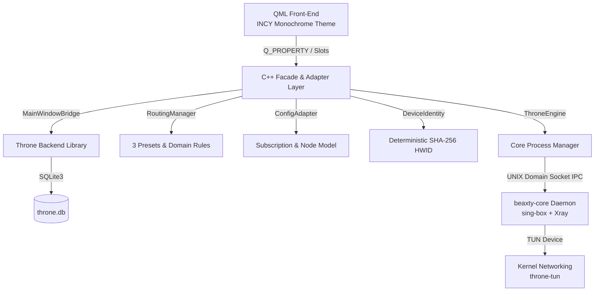

# BeaxtyVPN

For this independent working copy, see [local changes, build instructions, and verified limitations](LOCAL_CHANGES.md). Build and run from `build-local`.

**BeaxtyVPN** is a lightweight, high-performance desktop VPN client for Linux. It wraps the proven upstream core of [Throne](https://github.com/throneproj/Throne) (sing-box + Xray daemon, SQLite configuration database, routing rule engine, and subscription parser) while replacing its legacy QWidget interface with a modern, card-based Qt 6 Quick / QML user interface inspired by **INCY** and strict monochrome / OLED black & white aesthetics (`#0A0A0A`).

Licensed under the **GNU General Public License v3.0 (GPL-3.0)**.

---

## Key Highlights

- **Modern Monochrome Interface**: Strict OLED black-and-white minimalist design with card-based controls, tactile connect switch, real-time traffic speeds, and responsive navigation.
- **TUN Mode by Default**: Seamless system-wide traffic tunneling (`spmode_vpn = true`) without requiring manual SOCKS/HTTP proxy configuration in individual applications.
- **Deterministic Hardware ID (HWID)**: Default-enabled device identity (`sub_send_hwid = true`) generated via a cryptographically secure SHA-256 hash of `/etc/machine-id` for reliable multi-device subscription tracking without exposing raw machine identifiers.
- **Simplified 3-Preset Routing**:
  1. **Full Tunnel**: All traffic routed via the encrypted VPN tunnel.
  2. **Bypass Domestic & Local (RU)**: Intelligently bypasses domestic Russian services, banking, government domains (`geosite:ru`, `geoip:ru`), and local LAN subnets.
  3. **Custom Split-Tunneling**: Granular domain manager allowing users to add custom whitelist/blacklist rules.
- **Least-Privilege Security Architecture**: The GUI runs as a regular user. On Linux, TUN setup installs a root-owned copy of the exact core binary in a per-user protected directory and grants only `CAP_NET_ADMIN`; an ACL prevents other local users from executing that copy. The GUI and core never receive SUID-root.
- **Comprehensive Test Suite**: Automated verification covering unit tests, configuration generation, process lifecycle (0 zombie processes), and resource audits (<100ms startup, <35MB PSS memory, 0.0% idle CPU).

---

## Architecture Overview



---

## Prerequisites

On Arch Linux / Manjaro:
```bash
sudo pacman -S base-devel cmake ninja qt6-base qt6-declarative qt6-quickcontrols2 go protobuf acl libcap polkit
```

On Ubuntu / Debian:
```bash
sudo apt update
sudo apt install build-essential cmake ninja-build qt6-base-dev qt6-declarative-dev libqt6quickcontrols2-5-dev golang-go protobuf-compiler libprotobuf-dev acl libcap2-bin pkexec polkitd
```

On Fedora:
```bash
sudo dnf install @development-tools cmake ninja-build qt6-qtbase-devel qt6-qtdeclarative-devel golang protobuf-compiler acl libcap-devel polkit
```

---

## Build Instructions

### 1. Build the Go Core Daemon
The core daemon embeds `sing-box` (v1.14.0-rc.5) and `Xray-core` with support for VLESS Reality, Shadowsocks, WireGuard, gVisor, and Clash API:
```bash
./scripts/build_core.sh
```
This produces `bin/beaxty-core`.

### 2. Linux TUN permissions
On the first connection in TUN mode, the app explains why the permission is needed and asks for confirmation before making one Polkit request to a narrow installer helper. It verifies and installs a root-owned copy of the bundled core at a content-derived path in a per-user directory under `/usr/lib/beaxty-vpn`. A POSIX ACL allows only the current UID to traverse that directory; the core receives only `CAP_NET_ADMIN`. This requires `pkexec`, `acl`, and `libcap`; the app does not run the GUI as root and does not set SUID bits. After setup, later connections reuse the verified copy without asking again. If authorization is declined, TUN stays unavailable until permissions are configured.

Versions that used the old SUID setup may have left a privileged `beaxty-core` behind. This version refuses to launch a bundled core that still has SUID/SGID bits or file capabilities; an administrator must remove those old privilege bits before the bundled core can run.

### 3. Build the BeaxtyVPN Desktop Client
Configure and build with CMake and Ninja in Release mode:
```bash
cmake -B build -G Ninja -DCMAKE_BUILD_TYPE=Release
ninja -C build beaxty-vpn
```

### 4. Build Test Binaries
```bash
ninja -C build test_hwid test_config_builder test_subscription_import test_capture_ui
```

---

## Running the Application

Launch the desktop client:
```bash
./build/beaxty-vpn
```

Options:
- `--db <path>`: Specify custom SQLite database path (default: `~/.local/share/Beaxty/BeaxtyVPN/throne.db`).
- `--exit-after <ms>`: Automatically exit after specified milliseconds (useful for automated benchmarks and test pipelines).
- `--version`: Display version information.
- `--help`: Display available command-line arguments.

---

## Verification & Automated Test Suite

Build and run the registered unit and synthetic checks:
```bash
cmake -S . -B build -DCMAKE_BUILD_TYPE=Release
cmake --build build -j"$(nproc)"
ctest --test-dir build --output-on-failure
```

The static privilege audit can also be run with `bash tests/test_security_audit.sh`. It checks source and packaging invariants; it does not prove system firewall behavior, DNS leak protection, or safety under a live TUN connection.

The optional screenshot harness is offline and uses a temporary database plus an explicitly missing core binary:
```bash
QT_QPA_PLATFORM=offscreen BEAXTY_CAPTURE_DIR=/tmp/beaxty-ui-captures ./build/test_capture_ui
```

CTest and the screenshot harness do not start the VPN core or create a tunnel. Live TUN, crash-recovery, DNS-leak, and cross-platform integration tests remain outstanding. Do not use a developer's normal profile or terminate processes by executable-name matching in automated tests.

---

## Packaging & Portable Releases

### Linux AppImage & Portable Tarball
To automatically compile and build standalone portable packages for Linux:
```bash
./scripts/package_linux.sh
```
This produces two distribution-ready packages inside the `dist/` directory:
- `dist/BeaxtyVPN-Linux-x86_64.AppImage`: Self-contained executable AppImage with bundled Qt6 runtime and dependencies.
- `dist/BeaxtyVPN-Linux-x86_64-Portable.tar.gz`: Standalone portable directory with executable launcher `run.sh` (works without FUSE).

### Automated CI/CD (GitHub Actions)
The repository includes `.github/workflows/build-release.yml` which automatically compiles, packages, and releases 4 portable versions across 3 operating systems:
1. **Linux x86_64 AppImage** (`BeaxtyVPN-Linux-x86_64.AppImage`)
2. **Linux x86_64 Portable Tarball** (`BeaxtyVPN-Linux-x86_64-Portable.tar.gz`)
3. **Windows x86_64 Portable ZIP** (`BeaxtyVPN-Windows-x86_64-Portable.zip`, with Qt6 runtime and Wintun driver v0.14.1)
4. **macOS DMG** (`BeaxtyVPN-macOS.dmg`, built for the workflow runner architecture with bundled `BeaxtyVPN.app` and `beaxty-core`)

Releases are automatically published on git tag push (`v*`) or via manual trigger (`workflow_dispatch`).

---

## Project Structure

```
├── .github/workflows/     # CI/CD multi-platform build and release workflow
├── 3rdparty/throne/       # Upstream Throne core engine & database
├── bin/
│   └── beaxty-core        # Compiled Go core daemon (sing-box + Xray)
├── dist/                  # Generated AppImage, tar.gz, ZIP, DMG packages
├── res/                   # Desktop icons, .desktop file, and Qt resources
├── scripts/
│   ├── build_core.sh      # Core daemon build script
│   └── package_linux.sh   # Linux AppImage and portable tar.gz packager
├── src/
│   ├── bridge/            # Headless MainWindowBridge decoupling UI from backend
│   ├── core/              # C++ facade managers (ThroneEngine, ConfigAdapter,
│   │                      # DeviceIdentity, RoutingManager, TrafficMonitor)
│   ├── ui/qml/            # INCY-style monochrome Qt Quick interface
│   │   ├── components/    # Reusable card, switch, badge, and button components
│   │   └── views/         # DashboardView, NodesView, RoutingView, SettingsView
│   └── main.cpp           # Client entry point and system tray integration
└── tests/                 # Automated test and benchmark suite
```

---

## License

This project is licensed under the terms of the **GNU General Public License v3.0 (GPL-3.0)**. See `LICENSE` for details.
