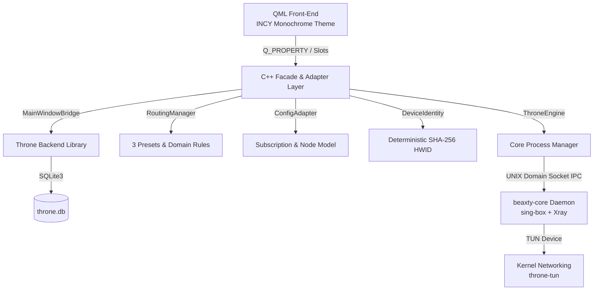

# BeaxtyVPN

**BeaxtyVPN** is a lightweight, high-performance desktop VPN client for Linux. It wraps the proven upstream core of [Throne](https://github.com/throneproj/Throne) (sing-box + Xray daemon, SQLite configuration database, routing rule engine, and subscription parser) while replacing its legacy QWidget interface with a modern, card-based Qt 6 Quick / QML user interface inspired by **INCY** and strict monochrome / OLED black & white aesthetics (`#0A0A0A`).

Licensed under the **GNU General Public License v3.0 (GPL-3.0)**.

---

## Key Highlights

- **Modern Monochrome Interface**: Strict OLED black-and-white minimalist design with card-based controls, tactile connect switch, real-time traffic speeds, and responsive navigation.
- **TUN Mode by Default**: Seamless system-wide traffic tunneling (`spmode_vpn = true`) without requiring manual SOCKS/HTTP proxy configuration in individual applications.
- **Deterministic Hardware ID (HWID)**: Default-enabled device identity (`sub_send_hwid = true`) generated via a cryptographically secure SHA-256 hash of `/etc/machine-id` for reliable multi-device subscription tracking without exposing raw machine identifiers.
- **Simplified 3-Preset Routing**:
  1. **Full Tunnel**: All traffic routed via the encrypted VPN tunnel.
  2. **Bypass Domestic & Local (RU)**: Intelligently bypasses domestic Russian services, banking, government domains (`geosite:ru`, `geoip:ru`), and local LAN subnets.
  3. **Custom Split-Tunneling**: Granular domain manager allowing users to add custom whitelist/blacklist rules.
- **Least-Privilege Security Architecture**: The GUI runs strictly as an unprivileged regular user (`non-root`), delegating network interface creation to the Go core daemon via Linux capabilities (`cap_net_admin,cap_net_bind_service+ep`).
- **Comprehensive Test Suite**: Automated verification covering unit tests, configuration generation, process lifecycle (0 zombie processes), and resource audits (<100ms startup, <35MB PSS memory, 0.0% idle CPU).

---

## Architecture Overview



---

## Prerequisites

On Arch Linux / Manjaro:
```bash
sudo pacman -S base-devel cmake ninja qt6-base qt6-declarative qt6-quickcontrols2 go protobuf
```

On Ubuntu / Debian:
```bash
sudo apt update
sudo apt install build-essential cmake ninja-build qt6-base-dev qt6-declarative-dev libqt6quickcontrols2-5-dev golang-go protobuf-compiler libprotobuf-dev libcap2-bin
```

On Fedora:
```bash
sudo dnf install @development-tools cmake ninja-build qt6-qtbase-devel qt6-qtdeclarative-devel golang protobuf-compiler libcap-devel
```

---

## Build Instructions

### 1. Build the Go Core Daemon
The core daemon embeds `sing-box` (v1.14.0-rc.5) and `Xray-core` with support for VLESS Reality, Shadowsocks, WireGuard, gVisor, and Clash API:
```bash
./scripts/build_core.sh
```
This produces `bin/beaxty-core`.

### 2. Configure Linux Capabilities (One-time setup for non-root TUN)
To allow `beaxty-core` to configure the TUN network interface without running the GUI as root:
```bash
./scripts/setup-cap.sh
```

### 3. Build the BeaxtyVPN Desktop Client
Configure and build with CMake and Ninja in Release mode:
```bash
cmake -B build -G Ninja -DCMAKE_BUILD_TYPE=Release
ninja -C build beaxty-vpn
```

### 4. Build Test Binaries
```bash
ninja -C build test_hwid test_config_builder test_subscription_import test_capture_ui
```

---

## Running the Application

Launch the desktop client:
```bash
./build/beaxty-vpn
```

Options:
- `--db <path>`: Specify custom SQLite database path (default: `~/.local/share/Beaxty/BeaxtyVPN/throne.db`).
- `--exit-after <ms>`: Automatically exit after specified milliseconds (useful for automated benchmarks and test pipelines).
- `--version`: Display version information.
- `--help`: Display available command-line arguments.

---

## Verification & Automated Test Suite

BeaxtyVPN includes an automated test and audit suite:

1. **End-to-End Subscription Import & SQLite Integrity**:
   ```bash
   ./build/test_subscription_import
   ```
   *Imports real VLESS links and Base64 subscription lists, verifying foreign key integrity (`PRAGMA foreign_key_check: 0 violations`) and database persistence.*

2. **Hardware Identity Validation**:
   ```bash
   ./build/test_hwid
   ```
   *Verifies deterministic SHA-256 generation from `/etc/machine-id` and masking in log outputs.*

3. **Sing-Box Config & Preset Generation**:
   ```bash
   QT_QPA_PLATFORM=offscreen ./build/test_config_builder
   ```
   *Verifies default TUN mode auto_route, 3 routing presets, and subscription parsing.*

4. **Performance & Resource Audit**:
   ```bash
   ./tests/test_performance.sh
   ```
   *Verifies cold start latency (<1.2s target, achieved: ~106ms), memory footprint (target <80MB, achieved: ~32MB PSS / 20MB private heap), and idle CPU usage (<0.5%, achieved: 0.0%).*

5. **TUN Lifecycle & Process Isolation**:
   ```bash
   ./tests/test_tun_lifecycle.sh
   ```
   *Runs 10 rapid connect/disconnect cycles, verifying zero zombie or orphaned processes.*

6. **Security & Privacy Audit**:
   ```bash
   ./tests/test_security_audit.sh
   ```
   *Verifies least-privilege non-root execution, Linux capabilities separation, zero cleartext secret leaks, and DNS leak defense.*

Run all automated tests together:
```bash
./build/test_subscription_import && \
./build/test_hwid && \
QT_QPA_PLATFORM=offscreen ./build/test_config_builder && \
./tests/test_performance.sh && \
./tests/test_tun_lifecycle.sh && \
./tests/test_security_audit.sh
```

---

## Packaging & Portable Releases

### Linux AppImage & Portable Tarball
To automatically compile and build standalone portable packages for Linux:
```bash
./scripts/package_linux.sh
```
This produces two distribution-ready packages inside the `dist/` directory:
- `dist/BeaxtyVPN-Linux-x86_64.AppImage`: Self-contained executable AppImage with bundled Qt6 runtime and dependencies.
- `dist/BeaxtyVPN-Linux-x86_64-Portable.tar.gz`: Standalone portable directory with executable launcher `run.sh` (works without FUSE).

### Automated CI/CD (GitHub Actions)
The repository includes `.github/workflows/build-release.yml` which automatically compiles, packages, and releases 4 portable versions across 3 operating systems:
1. **Linux x86_64 AppImage** (`BeaxtyVPN-Linux-x86_64.AppImage`)
2. **Linux x86_64 Portable Tarball** (`BeaxtyVPN-Linux-x86_64-Portable.tar.gz`)
3. **Windows x86_64 Portable ZIP** (`BeaxtyVPN-Windows-x86_64-Portable.zip`, with Qt6 runtime and Wintun driver v0.14.1)
4. **macOS Universal / arm64 DMG** (`BeaxtyVPN-macOS-Universal.dmg`, with bundled `BeaxtyVPN.app` and `beaxty-core`)

Releases are automatically published on git tag push (`v*`) or via manual trigger (`workflow_dispatch`).

---

## Project Structure

```
├── .github/workflows/     # CI/CD multi-platform build and release workflow
├── 3rdparty/throne/       # Upstream Throne core engine & database
├── bin/
│   └── beaxty-core        # Compiled Go core daemon (sing-box + Xray)
├── dist/                  # Generated AppImage, tar.gz, ZIP, DMG packages
├── res/                   # Desktop icons, .desktop file, and Qt resources
├── scripts/
│   ├── build_core.sh      # Core daemon build script
│   ├── package_linux.sh   # Linux AppImage and portable tar.gz packager
│   └── setup-cap.sh       # Linux capabilities setup script
├── src/
│   ├── bridge/            # Headless MainWindowBridge decoupling UI from backend
│   ├── core/              # C++ facade managers (ThroneEngine, ConfigAdapter,
│   │                      # DeviceIdentity, RoutingManager, TrafficMonitor)
│   ├── ui/qml/            # INCY-style monochrome Qt Quick interface
│   │   ├── components/    # Reusable card, switch, badge, and button components
│   │   └── views/         # DashboardView, NodesView, RoutingView, SettingsView
│   └── main.cpp           # Client entry point and system tray integration
└── tests/                 # Automated test and benchmark suite
```

---

## License

This project is licensed under the terms of the **GNU General Public License v3.0 (GPL-3.0)**. See `LICENSE` for details.
