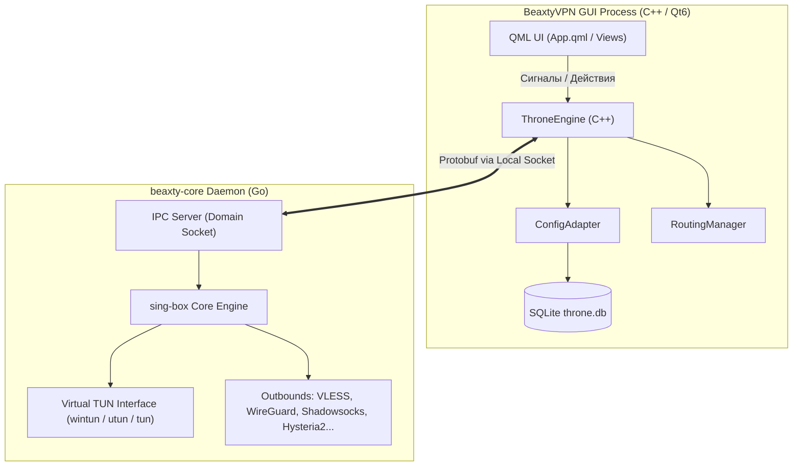

# Beaxty VPN — Полная архитектурная карта проекта

> **Цель документа**: Предоставить любому AI-агенту или разработчику исчерпывающее понимание архитектуры, стека, структуры каталогов, потоков данных, протоколов, истории решений и текущих нюансов сборки проекта **Beaxty VPN**.

---

## 1. Общая концепция и назначение проекта

* **Что это такое**: **Beaxty VPN** — кроссплатформенный (Linux, Windows, macOS) клиент для обхода блокировок и защиты трафика с открытым исходным кодом (лицензия **GPL-3.0**).
* **Происхождение**: Проект базируется на ядре и кодовой базе **Throne** (форк/эволюция), использующей движок **sing-box** (v1.14.0-rc.5) и **Xray-core** (26.7.28).
* **Дизайн и брендинг**: Строгий монохромный дизайн (Dark/Black/White), плавные векторные интерфейсы на QtQuick/QML, собственные шейдеры, кастомные иконки в SVG.
* **Главный принцип работы**: Разделение на **легковесный GUI-интерфейс (C++ / Qt 6)** и **высокопроизводительный системный демон маршрутизации (Go / sing-box)**, взаимодействующие по локальному межпроцессному каналу (IPC / Protobuf / Domain Socket).

---

## 2. Технологический стек

| Уровень / Компонент | Технологии / Библиотеки | Описание |
| :--- | :--- | :--- |
| **GUI / Frontend** | **C++20, Qt 6.8+ (QML, QtQuick, QtQuick Controls 2)** | Декларативный UI с поддержкой аппаратного ускорения RHI, кастомных шейдеров и динамических тем. |
| **Web-интеграция** | **QtWebEngine / QtWebChannel / SVG** | Встроенный личный кабинет пользователя (`CabinetView.qml`), открывающийся как внутри окна, так и через системный браузер. |
| **Core Daemon** | **Go 1.26, sing-box, Xray-core** | Бинарник `beaxty-core`, управляющий сетевыми туннелями, криптографией, DNS и правилами маршрутизации. Минимальная версия Go задаётся `go` директивой в `3rdparty/throne/core/server/go.mod`. |
| **Межпроцессная связь (IPC)** | **Framed Protobuf (Throne simple-protobuf) через Qt Local Sockets** | GUI/Core обмениваются ограниченными по размеру кадрами через локальный сокет: Unix Domain Socket на Linux/macOS и named pipe на Windows. Это не gRPC. |
| **Сетевые драйверы TUN** | **Wintun (Windows), Linux TUN/TAP (`cap_net_admin`), macOS `utun`** | Создание виртуального сетевого интерфейса для прозрачного перехвата и маршрутизации всего системного трафика. |
| **Локальное хранилище** | **SQLite 3 (`throne.db`)** | Локальная база данных подписок, серверов, настроек, пресетов маршрутизации и статистики трафика. |
| **Система сборки** | **CMake 3.20+, Ninja, GCC / Clang / MSVC 2022** | Мультиплатформенная сборка C++ бинарника и тестов. |
| **Упаковка релизов** | **AppImage (`linuxdeploy`, `appimagetool`), Windows Portable ZIP, macOS DMG** | Полностью автономные переносимые бандлы (Portable) без необходимости установки в систему. |

---

## 3. Структура каталогов репозитория

```text
beaxtyvpnapp/
├── .github/
│   └── workflows/
│       └── build-release.yml    # Полный CI/CD пайплайн для сборки и релизов (Linux, Win, macOS)
├── 3rdparty/
│   └── throne/                  # Исходный код подмодулей Throne
│       ├── core/                # Исходники Go-демона beaxty-core
│       │   ├── libcore/         # Protobuf-определения (libcore.proto)
│       │   └── server/          # Go-модули, sing-box, прокси-ядро
│       ├── include/             # C++ заголовочные файлы Throne
│       ├── res/                 # PNG/SVG ресурсы и иконки подмодуля
│       └── src/                 # Системные C++ интеграции (LinuxCap и др.)
├── bin/                         # Скомпилированный бинарник beaxty-core (локально)
├── build/                       # Рабочая директория сборки CMake/Ninja
├── dist/                        # Готовые скомпилированные артефакты (AppImage, zip, tar.gz)
├── res/                         # Ресурсы основного приложения
│   ├── icons/                   # Векторные иконки (app_icon.svg)
│   ├── beaxty-vpn.desktop       # Desktop-файл для Linux
│   └── beaxty-vpn.manifest      # Manifest с правами администратора для Windows
├── scripts/                     # Скрипты сборки и упаковки
│   ├── build_core.sh            # Сборка Go-демона beaxty-core с нужными тегами
│   ├── package_linux.sh         # Сборка автономного Linux AppImage и tar.gz
├── src/                         # Основной исходный код приложения (C++ / QML)
│   ├── main.cpp                 # Точка входа в приложение, CLI-парсер, Single-Instance Lock
│   ├── bridge/                  # Связующий слой между C++ и QML
│   │   ├── MainWindowBridge.cpp
│   │   └── MainWindowBridge.hpp
│   ├── core/                    # Бизнес-логика, синглтоны и менеджеры
│   │   ├── AppPrefs.cpp / .hpp          # Пользовательские настройки (темы, флаги)
│   │   ├── AutostartManager.cpp / .hpp  # Автозапуск при старте ОС (XDG / Registry)
│   │   ├── ConfigAdapter.cpp / .hpp     # Управление базой SQLite, парсер подписок
│   │   ├── DeepLinkManager.cpp / .hpp   # Обработка deep links beaxty://
│   │   ├── DeviceIdentity.cpp / .hpp    # Генерация стабильного аппаратного HWID
│   │   ├── LocalPeerCredentials.hpp     # Linux-проверка PID/UID peer перед IPC с core
│   │   ├── LocalizationManager.cpp/.hpp # Мультиязычность (RU, EN и др.)
│   │   ├── RoutingManager.cpp / .hpp    # Логика профилей маршрутизации
│   │   ├── ThroneEngine.cpp / .hpp      # Управление процессами демона, IPC, статус
│   │   ├── ToastManager.cpp / .hpp      # Менеджер всплывающих уведомлений
│   │   └── TrafficMonitor.cpp / .hpp    # Мониторинг скорости и объема трафика
│   └── ui/                      # Графический интерфейс на QML
│       ├── qml/
│       │   ├── App.qml                  # Корневое окно, темы, навигация
│       │   ├── Theme.qml                # Цветовая палитра и стили
│       │   ├── components/              # Переиспользуемые элементы UI
│       │   │   ├── ConnectButton.qml    # Главная кнопка подключения с анимацией
│       │   │   ├── ServerRow.qml        # Строка узла в списке серверов
│       │   │   ├── TrafficCard.qml      # Карточка трафика и скорости
│       │   │   ├── ImportSheet.qml      # Модальное окно импорта ссылок/конфигов
│       │   │   ├── PingBadge.qml        # Индикатор пинга узла
│       │   │   ├── ActionButton.qml     # Кнопки действий
│       │   │   └── ToggleSwitch.qml     # Переключатели
│       │   └── views/                   # Основные экраны приложения
│       │       ├── DashboardView.qml    # Главный экран подключения и статуса
│       │       ├── NodesView.qml        # Список серверов, выбор локации, пинг
│       │       ├── RoutingView.qml      # Настройка правил и режимов маршрутизации
│       │       ├── SettingsView.qml     # Настройки клиента, DNS, Kill Switch
│       │       ├── CabinetView.qml      # Личный кабинет пользователя
│       │       └── CabinetWebEngineComponent.qml # Динамический WebEngine-компонент
│       └── shaders/                     # QSB / GLSL шейдеры фона и волн
├── tests/                       # Модульные и интеграционные тесты (CTest)
│   ├── test_config_builder.cpp          # Тест генератора конфигураций sing-box
│   ├── test_deeplink.cpp                # Тест разбора beaxty:// deep links
│   ├── test_full_tunnel_wiring.cpp      # Тест связывания полного туннеля
│   ├── test_hwid.cpp                    # Тест генератора HWID
│   ├── test_per_app_routing.cpp         # Тест выборочной маршрутизации приложений
│   ├── test_routing_presets.cpp         # Тест пресетов маршрутизации
│   ├── test_safe_missing_core.cpp       # Проверка ранней ошибки без запуска демона
│   ├── test_security_audit.cpp          # Проверки security-инвариантов
│   ├── test_subscription_import.cpp     # Тест импорта ссылок подписок
│   ├── test_subscription_safety.cpp     # Тест защиты от вредоносных подписок
│   ├── test_traffic_looper_lifecycle.cpp # Проверка stop-флагов без core и туннеля
│   └── test_capture_ui.cpp               # Офлайн UI screenshot harness
└── CMakeLists.txt               # Главный файл конфигурации сборки проекта
```

---

## 4. Архитектура подсистем и потоки данных

### 4.1. Взаимодействие GUI и Core Daemon (IPC)


1. **Старт приложения**: `src/main.cpp` инициализирует `QLockFile` (защита от повторного запуска). Если экземпляр уже есть, он передает аргументы по локальному сокету и завершается.
2. **Инициализация БД**: `ConfigAdapter` открывает SQLite базу данных, читает сохраненные подписки, серверы и настройки.
3. **Запуск демона**: `ThroneEngine` запускает дочерний процесс `beaxty-core` с уникальным сокетом `/tmp/beaxtyIPC-<UUID>`.
4. **Подключение**: На Linux `ThroneEngine` сверяет kernel peer credentials принятого сокета с PID дочернего `beaxty-core` и UID текущего пользователя, затем передаёт локальный сокет RPC-клиенту Throne; тот владеет сокетом и переносит его в отдельный I/O-поток. Engine отслеживает только атомарный статус и поколение подключения; команды Start/Stop сериализуются отдельной очередью, а завершение ждёт текущих RPC-задач. Конфиг формируется по профилю и передаётся в sing-box как JSON/Protobuf.
5. **Мониторинг**: Демон шлет периодическую телеметрию (скорость, байты, состояние подключения) обратно в `TrafficMonitor`.

### 4.2. Маршрутизация (Routing)
Поддерживаются 4 базовых режима:
1. **Full Tunnel (Прямой туннель)**: Весь системный трафик заворачивается в прокси.
2. **Bypass Domestic / Russian IPs (Обход РФ)**: Трафик к российским диапазонам IP и доменам идет напрямую через шлюз провайдера, а заблокированные ресурсы — через VPN.
3. **Proxy Only**: Проксируются только заданные домены и списки.
4. **Per-App Routing (Выборочный трафик приложений)**: Маршрутизация трафика только выбранных `.exe` процессов (на Windows) или cgroups/UID (на Linux).

### 4.3. Поддерживаемые протоколы
* **VLESS** (с поддержкой Reality, Vision, XTLS, gRPC, WebSocket).
* **VMess** (WebSocket, TCP, HTTP Upgrade).
* **Shadowsocks** (современные 2022 шифры).
* **Trojan**.
* **WireGuard**.
* **Hysteria 2** и **TUIC** (высокоскоростные протоколы на базе UDP/QUIC).

---

## 5. Особенности сборки по платформам

### 5.1. Linux (AppImage & Portable Tarball)
* **Скрипт**: [`scripts/package_linux.sh`](file:///home/kumite/Documents/antigravity/beaxtyvpnapp/scripts/package_linux.sh)
* **Автономность**:
  * Скрипт копирует бинарники `beaxty-vpn` и `beaxty-core`.
  * Принудительно копирует **все companion-библиотеки Qt6** из `${QT_INSTALL_LIBS}` в `usr/lib` (`libQt6QuickLayouts.so.6`, `libQt6QuickTemplates2.so.6`, `libQt6QuickControls2.so.6`, `libQt6WaylandClient.so.6` и т.д.).
  * Запускает `linuxdeploy --deploy-deps-only` рекурсивно по `usr/plugins`, `usr/qml` и `usr/lib`.
  * **Автоматический валидатор `ldd`**: Перед упаковкой скрипт прогоняет `ldd` по каждому ELF-бинарнику. Если есть отсутствующие библиотеки или утечка на системный Qt (`/usr/lib/libQt6`), сборка прерывается.
  * **Права TUN**: при первом нажатии «Подключиться» приложение объясняет запрос и ждёт явного согласия. Один Polkit-вызов запускает узкий `beaxty-vpn-privileged-helper`. Он проверяет SHA-256 и расположение встроенного ядра, создаёт root-owned копию в `/usr/lib/beaxty-vpn/<UID>`, ограничивает проход ACL только текущим UID и назначает только `cap_net_admin=ep`; SUID-root не применяется. Дальше подключение переиспользует проверенную копию.
  * **Эмодзи в Linux**: в приложение встроен Noto Color Emoji с лицензией OFL 1.1. Для Unicode common script обычный системный UI-шрифт идёт раньше emoji fallback, чтобы цифры не отрисовывались цветным emoji-шрифтом.
  * **Важно**: Kill Switch не гарантирует блокировку системного трафика после падения ядра; приложение сообщает об этом явно.

### 5.2. Windows (Portable ZIP)
* **Компилятор**: MSVC 2022 64-bit, Ninja.
* **Qt**: Qt 6.8 (модули `qtshadertools`, `qt5compat`, `qtwebengine`, `qtwebchannel`, `qtpositioning`).
* **Развертывание**: `windeployqt.exe --qmldir src/ui --compiler-runtime`.
* **TUN драйвер**: Скачивается официальный `wintun.dll` (v0.14.1) и помещается рядом с `beaxty-vpn.exe`.
* **Go build**: `CGO_ENABLED=0 go build -tags "with_clash_api,with_gvisor,with_quic,with_wireguard,with_utls,with_dhcp,with_tailscale" -ldflags "-checklinkname=0"`.

### 5.3. macOS (DMG, одна архитектура)
* **Компилятор**: Apple Clang, Ninja, macOS 14 runner.
* **Развертывание**: `macdeployqt BeaxtyVPN.app -qmldir=src/ui`.
* **Подпись**: Ad-hoc code signing (`codesign --force --deep --sign -`).
* **Образ**: Упаковка в DMG через `hdiutil`; текущий workflow строит одну архитектуру runner'а и не выполняет universal/lipo-слияние.

---

## 6. Текущий статус, известные проблемы и нюансы

### 6.1. GitHub Actions CI/CD и квоты
1. **Лимит минут на приватном репозитории**:
   * В бесплатном тарифе для *Private* репозитория GitHub дает 2000 минут/мес.
   * Раннер **macOS имеет множитель 10x** (1 минута = 10 минут квоты). Из-за этого квота быстро исчерпывается.
   * *Решение*: Либо переключить репозиторий в **Public** (где Actions на 100% бесплатны и безлимитны), либо использовать локальную сборку / ручные релизы.
2. **Лимит хранилища артефактов (Artifact Storage Quota)**:
   * Была проблема с падением `actions/upload-artifact` из-за лимита 500 МБ.
   * *Решено*: Пайплайн переписан на прямую выгрузку в GitHub Releases (`gh release upload "$TAG" ... --clobber`), минуя временное хранилище Actions.
3. **Headless OpenGL в CI (Linux)**:
   * Виртуальный экран `xvfb-run` в Ubuntu не имеет физического GPU, из-за чего Qt 6 RHI падал на инициализации OpenGL.
   * *Решено*: Для тестов в CI установлены переменные программного рендеринга: `QT_QUICK_BACKEND=software`, `QT_XCB_GL_INTEGRATION=none`, `LIBGL_ALWAYS_SOFTWARE=1` и пакет `libgl1-mesa-dri`.

### 6.2. Важные нюансы кодовой базы
1. **Динамический WebEngine (`CabinetView.qml`)**:
   * QtWebEngine тяжелый и не всегда доступен в минимальных окружениях.
   * Реализован паттерн безопасной динамической загрузки: QML сначала проверяет контекстное свойство `hasWebEngine`, и если движка нет — показывает фолбэк с кнопкой открытия личного кабинета в системном браузере (`Qt.openUrlExternally`).
2. **Go Linker Checklinkname**:
   * На Go 1.23+ встроенный флаг компилятора требует `-checklinkname=0` в `-ldflags` при сборке sing-box/Xray из-за низкоуровневых runtime-хуков.
3. **Single-Instance Socket**:
   * Повторный запуск бинарника не запускает второй экземпляр, а шлет сообщение `show` или `DEEPLINK <url>` в локальный сокет работающего процесса, выводя главное окно на передний план.

---

## 7. Инструкция для быстрого старта нового агента

1. **Сборка ядра**:
   ```bash
   chmod +x scripts/build_core.sh
   ./scripts/build_core.sh
   ```
2. **Сборка C++ GUI**:
   ```bash
   cmake -B build -S . -G "Ninja" -DCMAKE_BUILD_TYPE=Release
   cmake --build build --target beaxty-vpn -j"$(nproc)"
   ```
3. **Запуск тестов**:
   ```bash
   ctest --test-dir build --output-on-failure
   ```
4. **Упаковка Linux AppImage**:
   ```bash
   chmod +x scripts/package_linux.sh
   ./scripts/package_linux.sh
   ```
5. **Тест запуска бинарника/AppImage**:
   ```bash
   ./build/beaxty-vpn --exit-after 1000
   ./dist/BeaxtyVPN-Linux-x86_64.AppImage --exit-after 2000
   ```
